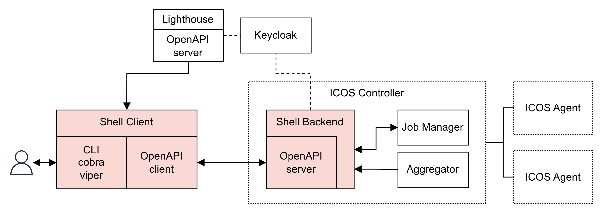

# ICOS Shell

ICOS Shell is a component part of the [ICOS Project](https://cordis.europa.eu/project/id/101070177)

- Shell Backend: server running as component of the ICOS controller
- Shell Client: CLI tool interfacing the Shell Backend



## Build and run

### Shell Backend 

Building and running the ICOS Shell Backend with Docker

```
cd backend
docker build -t "shell-backend" .
docker run --volume ./config.yml:/app/config.yml -p 8080:8080 shell-backend:latest
```

### Shell Client

Building and running the ICOS Shell Client with go
```
cd client
go build -o icos-shell
./icos-shell -h
```

## Development 

### OpenAPI

When updating OpenAPI, modify the `openapi.yaml` file from the root directory and regenerate both Shell Backend and Client with:

#### Shell Backend 
```
openapi-generator-cli generate -g go-server -i openapi.yaml -o backend/ --additional-properties=packageName=shellbackend
```

#### Shell Client 
```
openapi-generator-cli generate -g go -i openapi.yaml -o client/pkg/openapi --additional-properties=packageName=openapi,isGoSubmodule=true

rm client/pkg/openapi/go.mod client/pkg/openapi/go.sum
```

### CLI
Add commands to the Shell Client with `cobra-cli`, more info [here](https://github.com/spf13/cobra-cli#add-commands-to-a-project).


## Documentation

Current version of docs can be found in:

- Shell Backend [here](./backend/docs/README.md)
- Shell Client [here](./client/docs/icos-shell.md)

### Generate docs

Generate documentation OpenAPI docs for Shell Backend and CLI docs for Shell Client with:

#### Shell Backend 

```
openapi-generator-cli generate -g markdown -i openapi.yaml -o backend/docs/
```

#### Shell Client 
```
cd client/
go run main.go create docs --path docs
```
